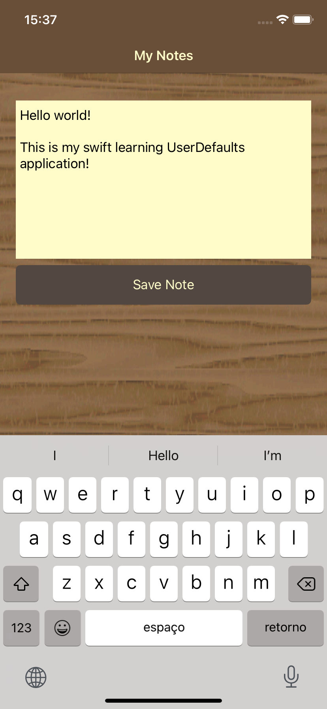
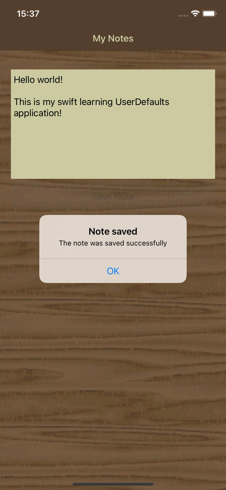

  

   <h2 align="center">
    Simple Note IOS App
  </h2>

  
  

Simple native IOS app using Swift and Storyboard for the purpose of learn how to work with UserDefaults on swift.

The app is just a simple note field that the data is persisted after press on save button.

Refers to udemy IOS course <a href="https://www.udemy.com/course/curso-desenvolvimento-ios/">https://www.udemy.com/course/curso-desenvolvimento-ios/</a>

# Preview

  
  
  

## Thanks

with ❤️ by Gustavo
